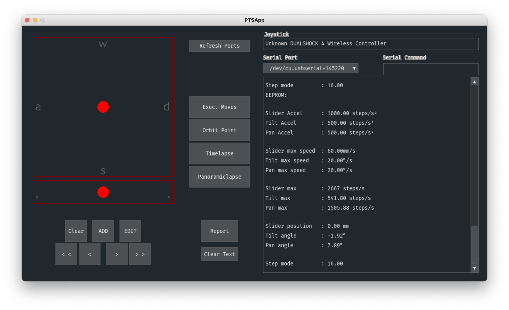

# Pan-Tilt-Mount-App
PTSApp is an desktop application written in Python for the Pan Tilt Mount created by Isaac Chasteau https://www.youtube.com/c/isaac879.

You can connect any controller via USB or BlueTooth and connect your Pan Tilt Mount via BlueTooth or anyother wireless serial adapter.

Watch a video of it in use here: https://youtu.be/ueD8rxHcdFw

To compile for yourself you need the following Python extensions:

Python 3.9 - https://www.python.org/downloads/ 
PyGame - https://www.pygame.org/wiki/GettingStarted 
PyGame-GUI - https://pygame-gui.readthedocs.io/en/latest/ 
PySerial - https://github.com/pyserial/pyserial

macOS - https://py2app.readthedocs.io/en/latest/install.html 
run to compile - python setup.py py2app

Windows 10 - https://cx-freeze.readthedocs.io/en/latest/installation.html 
run to compile - python setupcx.py build